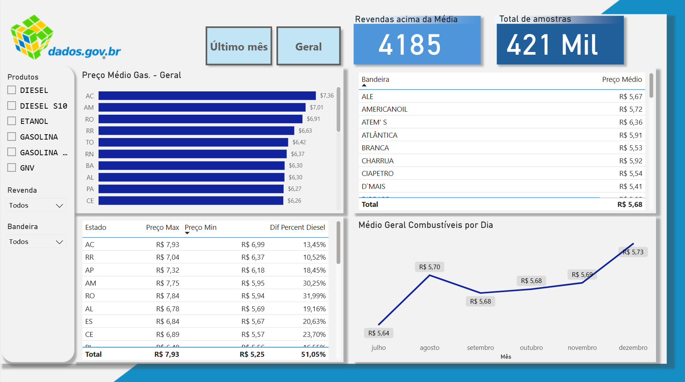

# 📦 Dados Gasolina No Brasil - Projeto de BI em Power BI

Este projeto simula a análise de uma base de dados sobre Gasolina. O objetivo é aplicar conhecimentos de Business Intelligence com **Power BI** para gerar **insights visuais** que auxiliam na tomada de decisões estratégicas e operacionais.

## 📊 Visão Geral do Dashboard

- Total de Amostras
- Revendas acima da Média
- Preços médios por estado, bandeiras e dia

## 🧠 Objetivos do Projeto

- Analisar quantas revendas vendem gasolina acima da média nacional
- Verificar em qual período do mês os preços tendem a ser maiores
- Maior preço médio por estado
- Diferenças percentuais entre menor e maior preço do diesel em casa estado

## 🧩 Como foi feito o projeto

1. ETL com Power Query (Linguagem M):
- Conectar aos dados brutos da ANP (CSV/Excel).
- Realizar a limpeza e transformação: corrigir tipos de dados, tratar valores nulos e padronizar informações.
- Estruturar o modelo em Star Schema, criando uma tabela Fato (preços) e Dimensões (Calendário, Produto, Localidade, Bandeira).

2. Medidas com DAX:
- Métricas Principais: Preço Médio, Preço Máximo/Mínimo, Total de Amostras.
- Lógica Avançada: Contagem de Revendas Acima da Média e Diferença Percentual de preços.

3. Visualização e Interatividade:
- Construir os gráficos do painel: cartões de KPI, gráficos de barras (por Estado), de linha (evolução mensal) e tabelas (por Bandeira).
- dicionar filtros (segmentadores) para Produto e Bandeira.
- Implementar interatividade total, onde a seleção em um gráfico filtra todo o dashboard, e usar botões para alternar entre as visões ("Último Mês" e "Geral").

## 💡 Tecnologias Utilizadas

- [Power BI](https://powerbi.microsoft.com/)
- DAX
- Power Query (M)
- Visualizações nativas do Power BI (gráficos, KPIs, mapas)
  
## 🎨 Design do Dashboard

O layout visual do projeto foi planejado no [Figma], antes da construção no Power BI. 
Essa etapa teve como objetivo garantir uma boa experiência visual, alinhada com princípios de design limpo e organizado.

## 📁 Estrutura do Projeto

📂 Dashboard-Gasolina
├── Projeto.pbix 
├── imagens/ 
│ ├── Dash-final.png
│ 
└── README.md

---

**Criado por:** Fabio Cerqueira Jeronymo  
💼 Estudante de Ciência da Computação | Foco em BI, SQL, Power BI, Python  

